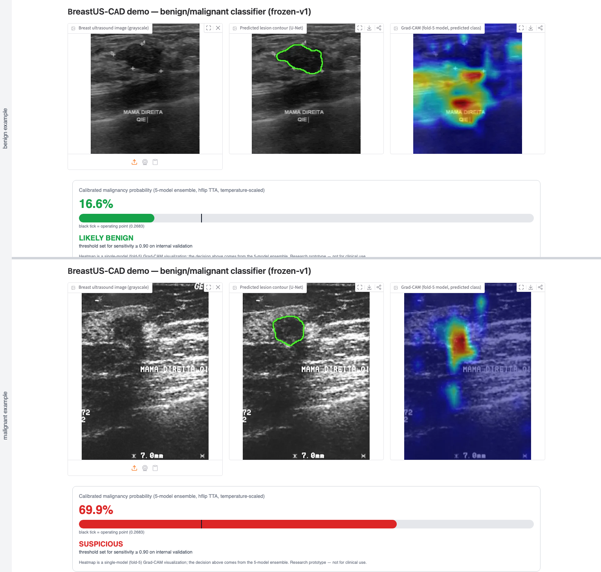

# BreastUS-CAD

> **Research prototype — not for clinical use. Not a medical device.**

Benign/malignant breast ultrasound classification with a frozen,
internally pre-registered, single-shot external validation across four
cohorts on three continents — plus deployment-oriented follow-up studies
(site-specific recalibration, multi-source training).

**[Live demo](https://huggingface.co/spaces/happytommy/breast-us-cad)** ·
[Weights](https://huggingface.co/happytommy/breast-us-cad-weights) ·
[Full report](docs/report.md) ·
[Independent audit](docs/AUDIT_2026-09-06.md) /
[response](docs/AUDIT_RESPONSE_2026-09-06.md)

Malignant-class Grad-CAM localizes to the lesion body and margin
(bottom row). Benign-class Grad-CAM is diffuse by nature — 'benign
evidence' is the absence of a suspicious focus — and can include the
burned-in annotation text present in every BUS-BRA image (top row). This
is a documented limitation of the training set; the border-occlusion probe
in RESULTS.md shows its effect on predicted probabilities is small. CAMs
are single-model (fold-5) visualizations; decisions come from the 5-model
ensemble.

## Headline results

| | AUC | Sens | Spec |
|---|---|---|---|
| Internal (a): single model, no TTA, 5-fold patient-level CV, best epoch on the reported fold | 0.9307 ± 0.0161 | — | — |
| Internal (a′, POST-HOC): same runs, val AUC at one fixed epoch (18) | 0.9195 ± 0.0164 | — | — |
| Internal (b): 5-ckpt ensemble + hflip TTA + T, pooled OOF (n=1875) | 0.9254 | 0.903 † | 0.771 † |
| Internal (b′, POST-HOC): nested operating point, threshold from the other 4 folds, evaluated per fold | — | 0.900 ± 0.057 | 0.780 ± 0.132 |
| BrEaST (Poland, n=252) | 0.854 | 0.918 | 0.409 |
| BUSI cleaned (Egypt, n=379) | 0.934 | 0.957 | 0.630 |
| GDPH (China, n=810) | 0.915 | 0.971 | 0.453 |
| SYSUCC (China, n=1013) | 0.838 | 0.931 | 0.474 |

Rows (a) and (b) are two different predictors. In (a) each fold's AUC is
that of the checkpoint saved at the epoch with the best AUC on the same
held-out fold (`best_epoch` in `reports/cv_vit_summary.csv`), so the CV
mean is optimistically biased; row (a′) quantifies it post hoc from the
wandb histories (optimism 0.011 ± 0.007 AUC). The pooled OOF predictions
in (b) inherit those checkpoints. † Sens/spec in (b) are **in-sample**:
the frozen threshold 0.2683 (sens ≥ 0.90 rule) was fitted on the same
calibrated pooled-OOF predictions it is evaluated on; row (b′) is the
nested out-of-sample estimate (thresholds 0.236–0.311; held-out sens
misses 0.90 on 3/5 folds). Both POST-HOC rows: RESULTS.md "Post-hoc
analyses responding to the 2026-09-06 audit". External rows: single-shot
at that frozen threshold, never re-tuned.

**Key finding:** discrimination transfers reasonably (BUSI and GDPH
within or near the internal range; BrEaST and SYSUCC lower, both CIs
below the internal 0.9254); the operating point does not. The frozen
threshold held sensitivity 0.918–0.971 on every external cohort while
specificity dropped from 0.771 (in-sample internal) to 0.409–0.630, i.e.
the errors are false positives, not missed cancers — whether that
direction is "safe" was not assessed (no harm analysis). Follow-up
studies: re-selecting only the threshold on 10–20 local labels recovers
near-oracle specificity **in the median** (pre-registered k*), at a
median sensitivity of 0.83–0.91 at k=10; the POST-HOC draw-level
reliability bar (k_reliable) was reached only on GDPH at k=200 and not
reached on the other three cohorts within the pre-registered grid.
Multi-source LOCO training met its pre-registered criterion via the AUC
branch (ΔAUC +0.013 to +0.056 vs the v1 fold-5 **single** model on 4/4
held-out cohorts), with these caveats stated alongside: 2/4 paired ΔAUC
CIs include zero (BrEaST, SYSUCC); the specificity branch failed 2/4
(held-out sens 0.847 / 0.800 < 0.85); against the deployed v1 ensemble
only 2/4 cohorts reach +0.01; the registered question concerned the
specificity collapse. Δspec +0.27 to +0.30 (paired CIs exclude zero, at
different thresholds per model), held-out sensitivity 0.80–0.96.
[Details in the report.](docs/report.md)

## Why this repo might be worth your time

- **Patient-level splits only**, enforced by tests (need the raw datasets
  on disk)
- **Internally pre-registered protocols** (external protocol + 4
  amendments) committed before the computations they govern — in a
  private, version-controlled history with no external timestamp; see
  "Provenance" below
- **Freeze-then-test**: single-shot external validation, results
  recorded regardless of outcome (`git tag external-v1`); each prediction
  CSV has exactly one adding commit
- **Dataset auditing**: 12.06M-pair perceptual-hash sweep (all
  within- and cross-set pairs among 1875/252/379/846/1559 images; 35%
  duplicates found in one public cohort, incl. the same image released
  under both class labels). Result: no near-duplicate at pHash d ≤ 8 —
  not "zero overlap"
- **Three pre-registered negative results** (CoarseDropout — a visual
  gate on three images; ensemble-disagreement abstention 0/4;
  domain-pretrained BiomedCLIP backbone NOT CLAIMED), reported as
  registered
- Every number in RESULTS.md recomputes from committed CSV/JSON
  artifacts; the deployed demo shares the same model, calibration and
  inference module as the validation pipeline, while its preprocessing
  differs from the validation path on non-BUS-BRA image sizes
  (documented; impact on calibrated probability ≤ 7×10⁻³)

## Repository map

    src/            training, evaluation, frozen inference, v2 studies
    configs/        one YAML per experiment
    data/external_protocol.md   pre-registered protocol + amendments
    data/splits/    busbra_official_5fold.csv (verbatim official BUS-BRA
                    partition, CC BY 4.0, notice in BUSBRA_LICENSE.txt) +
                    frozen external keep-lists (busi/gdph/sysucc_clean.csv)
    models/         calibration + operating-point JSONs and CHECKSUMS.txt
                    (sha256 of every published weight); the .pt checkpoints
                    are git-ignored and live on HF (see below)
    tests/          patient-level split guards (pytest)
    RESULTS.md      every number, chronological, commit-linked
    plan.md         task state
    reports/        figures & per-image predictions (CSV)
    app/ deploy/    Gradio demo (local / HF Space)
    docs/           report, independent audit + response

**Folds and weights.** The official BUS-BRA partition is committed as
`data/splits/busbra_official_5fold.csv` (byte-identical to the dataset's
`5-fold-cv.csv`, Zenodo 8231412, CC BY 4.0); `data.resolve_fold_file`
prefers it, falls back to `data/raw/busbra/5-fold-cv.csv`, and refuses
any file whose sha256 differs from the official one. All checkpoints
(`models/*.pt`) are git-ignored and published at
[happytommy/breast-us-cad-weights](https://huggingface.co/happytommy/breast-us-cad-weights):
the five frozen-v1 classifiers, the segmentation model and the two JSONs
at the repo root (the only files the demo uses), and the v2 research
artifacts under `v2/` (`v2_biomedclip_fold{1-5}.pt`,
`v2_loco_{breast,busi,gdph,sysucc}.pt`, their JSONs, and the exported
BiomedCLIP init). `models/CHECKSUMS.txt` holds the sha256 of every
published file; `inference.resolve_weight` resolves both layouts.

## Reproduce

    uv venv --python 3.12 && source .venv/bin/activate
    uv pip install -r requirements.txt

**Dataset layout (hardcoded paths).** Download from the original sources
(see below) into exactly:

    data/raw/busbra/            bus_data.csv, 5-fold-cv.csv, Images/, Masks/
    data/raw/breast_poland/     caseXXX.png + BrEaST-Lesions-USG-clinical-data-Dec-15-2023.xlsx
    data/raw/busi/              images/, masks/  (Curated BUSI)
    data/raw/gdph_sysucc/       GDPH/, SYSUCC/, BIRADS&FOLD.xlsx

**Frozen-v1 inference (exact).** With BUS-BRA on disk:

    python src/external_val.py --self-check

This re-runs the frozen pipeline on BUS-BRA fold 5 and must reproduce
AUC 0.9234433158791243 digit-for-digit (output byte-identical to
`reports/external_selfcheck.txt`). If `models/cv_vit_fold5.pt` is
absent, `inference.resolve_weight` **downloads it from the HF weights
repo automatically** (network access; default local HF cache) — there
is no offline switch. `pytest` runs the 8 split tests (all five raw
datasets required).

**Regenerating frozen-v1 from scratch (approximate).** The frozen
artifacts came from the full chain, not from a single `train.py` call
(`python src/train.py --config configs/vit.yaml` trains ONE model,
folds 1–4 → fold 5, to `models/vit_b16_fold5.pt`):

    python src/cross_validate.py --config configs/vit.yaml --prefix cv_vit   # 5 ckpts + reports/cv_vit_summary.csv
    python src/tta_eval.py          # hflip TTA → reports/oof_vit_preds.csv, tta_vit_summary.csv
    python src/calibrate.py         # T → models/calibration.json
    python src/pick_threshold.py    # thr → models/operating_point.json

Training logs to wandb and `train.py` has no offline flag; to run without
an account set `WANDB_MODE=offline` (or run `wandb offline`) before
launching. **MPS training is not bitwise reproducible** (no deterministic
algorithms, 4 DataLoader workers), so regenerated checkpoints will not
match the published ones digit-for-digit; only inference on the
downloaded frozen weights is exact.

## Provenance and limitations of pre-registration

- The protocol and its four amendments are an **internal,
  version-controlled pre-registration** (`data/external_protocol.md`,
  append-only; Amendments 2/3/4 each committed alone before the
  computation they govern). They were **not externally time-stamped**
  (no OSF/Zenodo registration at the time of the runs).
- On 2026-08-31 the identity of all prior commits was rewritten with
  `git filter-branch` (hostname-derived email → the author's email);
  author/committer dates were preserved, tags carried over, and the
  `frozen-v1` annotated tag re-created at the same date (commit 2c24500
  message). Pre-rewrite hashes therefore do not map to current commits.
- The repository was **private at audit time (2026-09-06)**; the only
  public artifact, the HF weights repo (created 2026-08-30), postdates
  the external-v1 commit (2026-08-29). The freeze-before-test ordering
  currently rests on local, rewritten, self-assigned commit timestamps.
- Amendment 1 already contained the dedup counts and pHash outcome it
  registers (it precedes all model metrics, not the data audit).
- TTA adoption (hflip) was not pre-registered: decided pre-freeze after
  seeing +0.0023 pooled OOF AUC, on the same OOF data later used to fit
  T and the threshold.
- Done (P2, 2026-09-07): post-hoc quantification of the epoch-selection
  and in-sample operating-point biases; `train.py` now stores the folds
  actually used in each checkpoint (existing checkpoints carry the raw
  YAML). Done (P3, 2026-09-07): v2 checkpoints published under `v2/` with
  `models/CHECKSUMS.txt`; official fold file committed and hash-verified.
  Done (P4, 2026-09-07): [docs/PROVENANCE.md](docs/PROVENANCE.md) — tag
  timeline, identity-rewrite evidence (full pre→post commit mapping by tree
  hash), HF timestamps, forward OSF commitment; CITATION.cff and
  .zenodo.json prepared; Zenodo DOI pending upload.

## Data availability & licenses

All datasets are public research releases; none are redistributed in
this repo. Download links, citations, and license notes for all five
cohorts in [data/README.md](data/README.md): BUS-BRA, BrEaST, and
Curated BUSI are CC BY 4.0; GDPH and SYSUCC come from the HoVer-Trans
release (Mo et al., *IEEE TMI* 2023, DOI 10.1109/TMI.2023.3236011) —
no license file accompanies that release, so check its original terms.

## Limitations

Single-institution training data; no IRB'd clinical validation;
internal CV AUC is best-epoch-on-the-reported-fold and the internal
operating point is in-sample; burned-in annotations are a potential
shortcut; external cohorts without patient IDs force image-level
bootstraps; pre-registration is internal only (above). Full list in
[report §4.5](docs/report.md).

## Citation

See [CITATION.cff](CITATION.cff) (version 1.0-audited). Zenodo DOI:
pending (archive of tag `v1.0-audited` = commit 1f196a9, sha256
`fcd270a5f6f9e30e…`, full record in [docs/PROVENANCE.md](docs/PROVENANCE.md)). Manuscript in
preparation.
